# 📚 BookSteam — Platform Jual Beli Buku Digital

> Platform jual beli dan baca buku digital bergaya Steam, dilengkapi sistem gamifikasi EXP, Family Sharing, dan ekosistem publisher terintegrasi.

---

## 📑 Daftar Isi

- [Gambaran Umum](#-gambaran-umum)
- [User Roles](#-user-roles)
- [Fitur Utama](#-fitur-utama)
- [Business Rules](#-business-rules)
  - [Return Policy](#return-policy)
  - [EXP & Leveling System](#exp--leveling-system)
  - [Family Sharing](#family-sharing)
  - [Revenue Share](#revenue-share)
  - [Sistem Pembayaran](#sistem-pembayaran)
- [Tech Stack](#-tech-stack)
- [Arsitektur Sistem](#-arsitektur-sistem)
- [Data Flow Diagram (DFD)](#-data-flow-diagram-dfd)
- [Workflow Diagram](#-workflow-diagram)
- [Activity Diagram](#-activity-diagram)
- [Flowchart](#-flowchart)
- [Database Map (ERD)](#-database-map-erd)
- [Halaman & Routing](#-halaman--routing)
- [Cara Menjalankan](#-cara-menjalankan-development)
- [Akun Development](#-akun-development-seed-data)
- [Roadmap Pengembangan](#-roadmap-pengembangan)

---

## 🌐 Gambaran Umum

BookSteam adalah platform buku digital yang mengadopsi model ekosistem Steam ke dunia literasi. User dapat membeli, membaca, dan meminjamkan buku digital. Publisher dapat menerbitkan karya mereka dan mendapatkan revenue. Seluruh aktivitas pengguna menghasilkan EXP yang digunakan untuk membuka fitur-fitur eksklusif.

---

## 👥 User Roles

| Role | Deskripsi |
|---|---|
| **Public** | Pengunjung tanpa akun. Dapat melihat landing page, homepage, katalog, halaman detail buku, dan menggunakan fitur search. **Tidak bisa** membeli atau membaca buku. |
| **User** | Public yang telah mendaftar (email + username + password). Dapat membeli buku, membaca buku yang dimiliki, melakukan return, dan menggunakan Family Sharing setelah level EXP mencukupi. |
| **Publisher / Jurnalis** | Akun yang telah diverifikasi admin. Dapat mengupload buku, mengedit harga dan metadata, serta melihat histori penjualan dan penarikan dana. |
| **Admin** | Pengelola platform. Dapat menghapus, mengedit, dan mengupload informasi & event di dashboard beranda, serta memoderasi buku dan publisher. |

---

## ⚡ Fitur Utama

### Untuk Public
- ✅ Lihat Landing Page
- ✅ Browse katalog buku
- ✅ Lihat halaman detail buku (judul, deskripsi, cover, harga)
- ✅ Search & filter buku

### Untuk User (Terdaftar)
- ✅ Semua fitur Public
- ✅ Beli buku via e-wallet, kartu kredit, atau Platform Wallet
- ✅ Top-up Platform Wallet
- ✅ Membaca buku yang dimiliki (Reader in-app)
- ✅ Return buku (sesuai policy)
- ✅ Wishlist
- ✅ Tulis review & rating
- ✅ Mendapatkan EXP dari aktivitas
- ✅ Family Sharing (unlock via EXP)
- ✅ Friendlist

### Untuk Publisher
- ✅ Upload buku baru (pending review admin)
- ✅ Edit harga & metadata buku
- ✅ Toggle Family Sharing per buku
- ✅ Lihat histori penjualan
- ✅ Request penarikan dana (withdrawal)

### Untuk Admin
- ✅ Review & approve/reject aplikasi publisher
- ✅ Review & approve/reject buku yang diupload
- ✅ Takedown buku yang melanggar aturan
- ✅ Kelola event & banner di beranda
- ✅ Manajemen user (ban/suspend)

---

## 📋 Business Rules

### Return Policy

| Tipe Buku | Return Window | Batas Progress Baca |
|---|---|---|
| Novel / Non-fiksi | **5 hari** setelah pembelian | Maksimal **30%** halaman dibaca |
| Komik / Manga / Webtoon | **1 hari** setelah pembelian | Maksimal **30%** halaman dibaca |

> **Catatan:** Refund dikembalikan ke Platform Wallet user, bukan ke metode pembayaran asal. EXP yang didapat dari pembelian tersebut juga ikut dikurangi saat return berhasil.

---

### EXP & Leveling System

#### Sumber EXP

| Aktivitas | EXP Didapat |
|---|---|
| Beli Buku | +50 EXP per buku |
| Selesai Membaca Buku | +100 EXP per buku |
| Tulis Review (diapprove) | +25 EXP per review |
| Login Harian | +5 EXP per hari (streak) |
| Referral (ajak teman) | +200 EXP per referral berhasil |
| Return Buku | **-50 EXP** (deduction) |

#### Level & Unlock

| Level | Total EXP | Fitur Terbuka |
|---|---|---|
| Level 1 | 0 EXP | Akun dasar, beli & baca buku |
| Level 5 | 500 EXP | 🔓 Family Sharing (maks. 3 anggota) |
| Level 10 | 1.500 EXP | 🔓 Family Sharing diperluas (maks. 6 anggota) |
| Level 15 | 3.000 EXP | 🔓 Early Access buku baru |

---

### Family Sharing

- Hanya bisa dibuat oleh user yang telah mencapai **Level 5 (500 EXP)**
- Owner membuat Family Group dan mengundang teman dari friendlist
- Publisher **bebas memilih** apakah buku mereka dapat di-share (toggle ON/OFF per buku)
- Buku yang di-share hanya dapat diakses satu orang pada satu waktu (owner **ATAU** anggota, tidak bersamaan)
- Jika owner return buku, akses family sharing untuk buku tersebut otomatis dicabut

---

### Revenue Share

```
Setiap penjualan buku:
├── Publisher mendapat: 65%
└── Platform mendapat:  35%
```

#### Alur Dana

1. User beli buku → Dana masuk **escrow** (ditahan)
2. Return window berjalan (1 atau 5 hari)
3. Jika **tidak di-return** → Dana dilepas → dibagi 65/35
4. Jika **di-return** → Refund penuh ke wallet user, tidak ada pembagian revenue
5. Publisher dapat request **withdrawal** setelah dana tersedia di balance

---

### Sistem Pembayaran

| Metode | Tipe |
|---|---|
| GoPay | E-wallet |
| OVO | E-wallet |
| ShopeePay | E-wallet |
| QRIS | E-wallet / QR |
| Visa / Mastercard | Kartu Kredit |
| Platform Wallet | Saldo internal (seperti Steam Wallet) |

> **Payment Gateway:** Midtrans (untuk e-wallet & kartu kredit)

---

## 🛠 Tech Stack

| Layer | Teknologi |
|---|---|
| **Frontend** | Next.js 14 (App Router), React, Tailwind CSS |
| **Backend** | Node.js 22 + Express |
| **Database** | MySQL 8.4 |
| **Cache / Session** | Redis 7 |
| **File Storage** | AWS S3 / Cloudflare R2 |
| **Payment** | Midtrans |
| **Email** | SendGrid / Nodemailer |
| **Auth** | JWT + Refresh Token |
| **Containerization** | Docker + Docker Compose |

---

## 🏗 Arsitektur Sistem

```
┌─────────────────────────────────────────────────────────────┐
│                      Client Layer                           │
│          Next.js 14 (App Router + React Server Components)  │
│                    Tailwind CSS UI                          │
└──────────────────────────┬──────────────────────────────────┘
                           │ HTTPS / REST API
┌──────────────────────────▼──────────────────────────────────┐
│                       API Layer                             │
│               Node.js 22 + Express — REST API               │
│               JWT Auth Middleware + RBAC                    │
└──────┬─────────────┬──────────────┬──────────────┬──────────┘
       │             │              │              │
┌──────▼──┐   ┌──────▼──┐   ┌──────▼──┐   ┌──────▼──────────┐
│Midtrans │   │  AWS S3  │   │SendGrid │   │  MySQL 8.4       │
│Payment  │   │  Storage │   │  Email  │   │  + Redis 7 Cache │
└─────────┘   └──────────┘   └─────────┘   └─────────────────┘

```

### 🐳 Arsitektur Docker

```
┌─────────────────────────────────────────────────────────────────┐
│                     Docker Compose Stack                        │
│                      (booksteam_net)                            │
│                                                                 │
│  ┌──────────────────┐      ┌──────────────────────────────────┐ │
│  │   booksteam_api  │      │         booksteam_migrate        │ │
│  │  (Node.js 22)    │      │   (run-once migration job)       │ │
│  │  :3000 → :3000   │      │   node src/config/runMigrations  │ │
│  └────────┬─────────┘      └──────────────┬───────────────────┘ │
│           │ depends_on (healthy)           │ depends_on (healthy)│
│           └──────────────┬────────────────┘                     │
│                          │                                      │
│            ┌─────────────▼──────────────┐                       │
│            │       booksteam_db         │                       │
│            │       MySQL 8.4            │                       │
│            │       :3306 → :3306        │                       │
│            │       volume: db_data      │                       │
│            └────────────────────────────┘                       │
│                                                                  │
│            ┌────────────────────────────┐                       │
│            │      booksteam_redis       │                       │
│            │      Redis 7-alpine        │                       │
│            │      :6379 → :6379         │                       │
│            │      volume: redis_data    │                       │
│            └────────────────────────────┘                       │
└─────────────────────────────────────────────────────────────────┘
```

### Struktur File

```
booksteam/
├── docker-compose.yml          ← Orkestrasi semua service
├── backend/
│   ├── Dockerfile              ← Multi-stage build (deps + runtime)
│   ├── .dockerignore
│   ├── .env                    ← Konfigurasi lokal (tidak masuk image)
│   ├── package.json
│   ├── db/
│   │   └── migrations/
│   │       ├── 001_initial_schema.sql
│   │       └── 002_seed_data.sql
│   └── src/
│       ├── app.js
│       ├── server.js
│       ├── config/
│       │   ├── database.js     ← mysql2 connection pool
│       │   └── runMigrations.js
│       ├── controllers/
│       ├── middlewares/
│       ├── routes/public/
│       └── services/
└── README.md
```

---

## 📊 Data Flow Diagram (DFD)

### Level 0 — Context Diagram

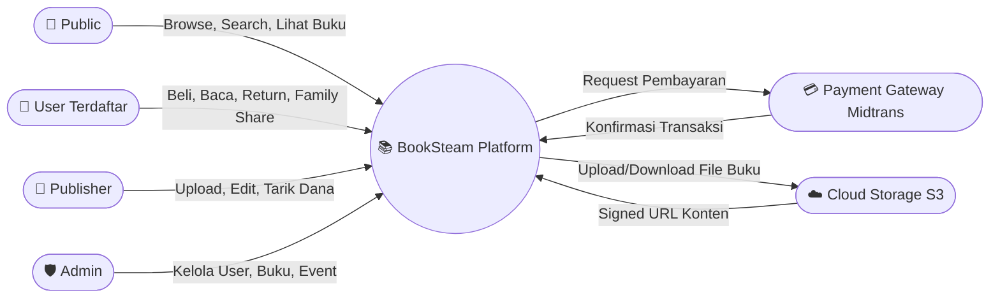

---

### Level 1 — Proses Utama

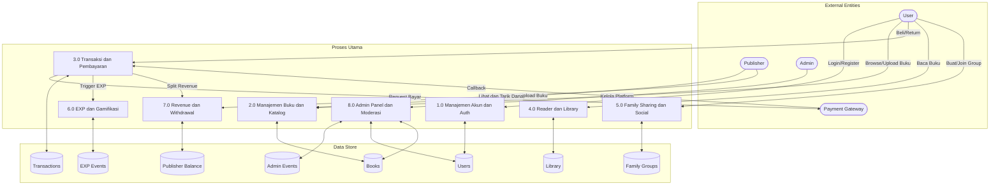

---

### Level 2 — Detail Alur Transaksi & Escrow

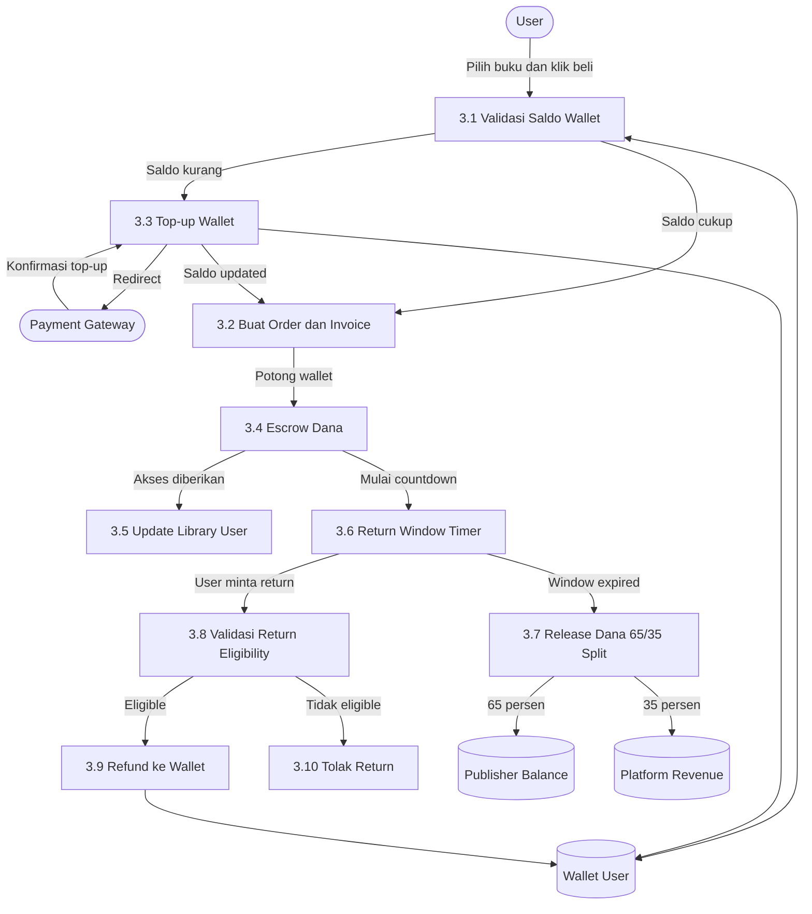

---

## 🔀 Workflow Diagram

### User Journey Lengkap

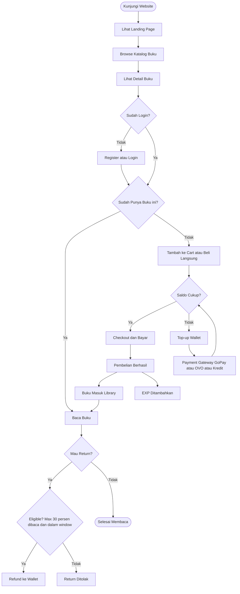

---

### Publisher Journey

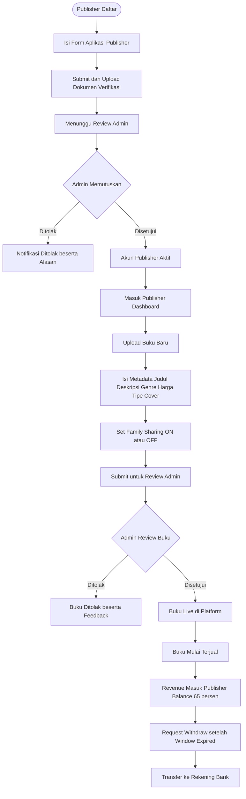

---

### Admin Moderasi

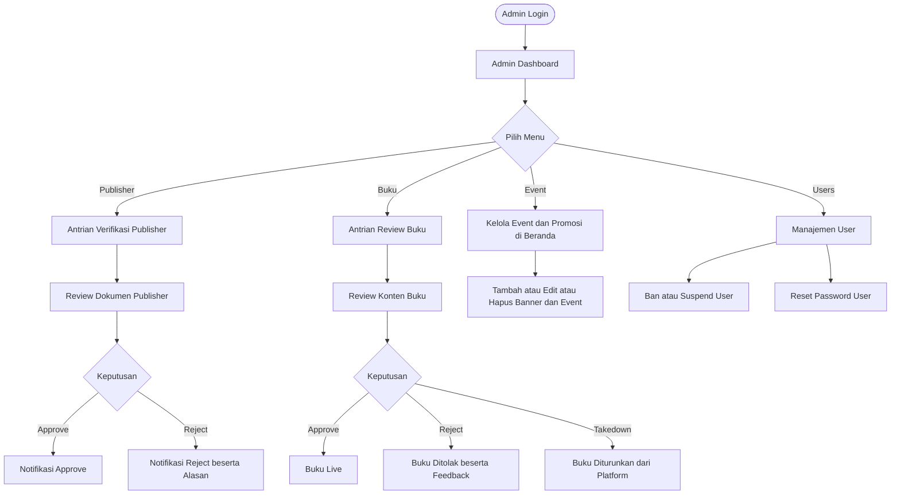

---

## 🔁 Activity Diagram

### Register & Login

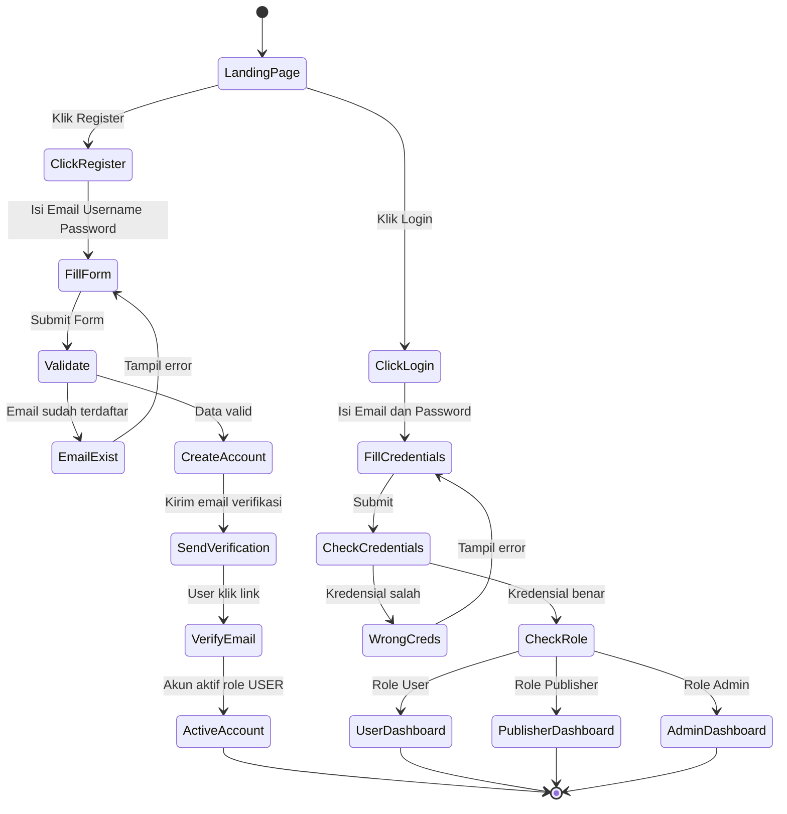

---

### Family Sharing

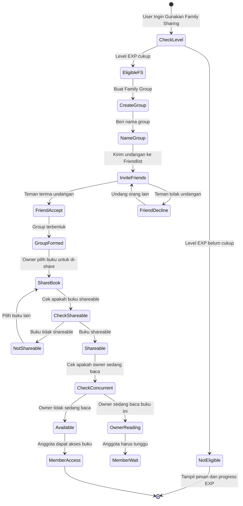

---

## 🔄 Flowchart

### Sistem EXP & Leveling

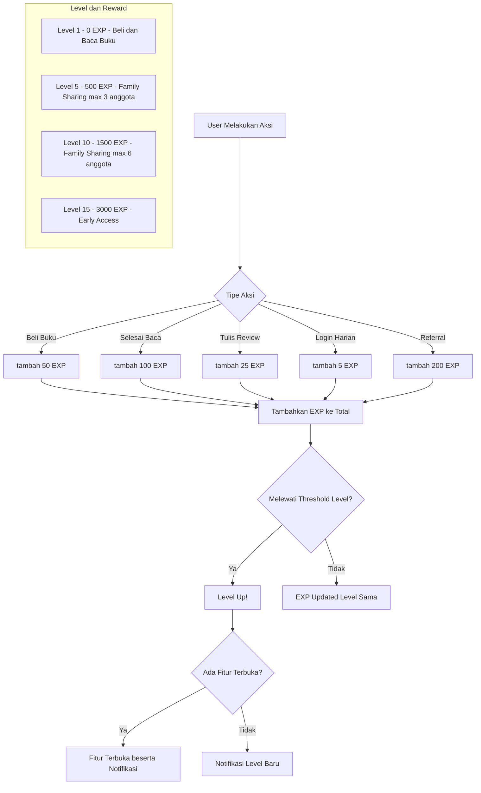

---

### Return Buku

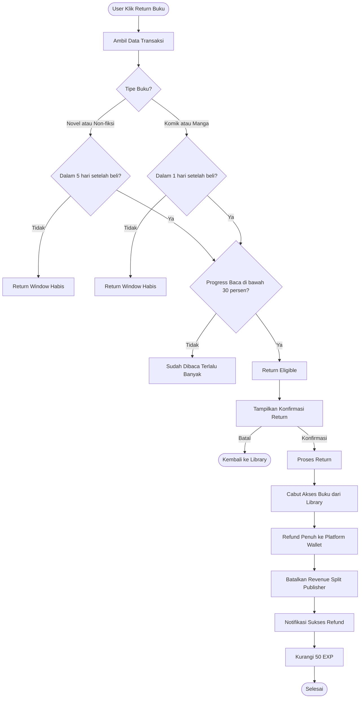

---

## 🗃️ Database Map (ERD)

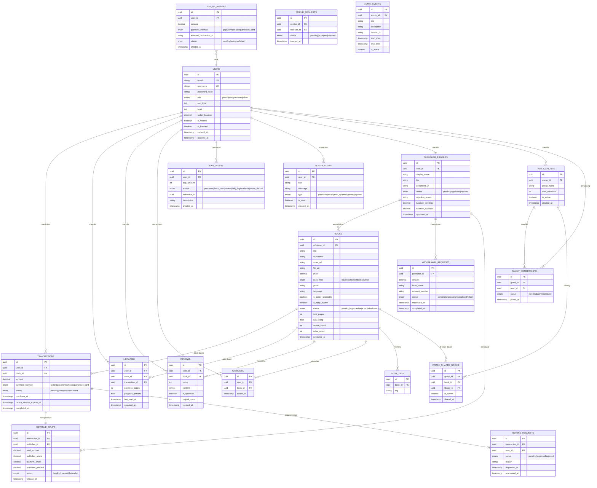

---

## 🗂️ Halaman & Routing

```
/                           → Landing Page (Public)
/store                      → Browse Katalog Buku (Public)
/store/:bookId              → Halaman Detail Buku (Public)
/search                     → Hasil Pencarian (Public)
/login                      → Halaman Login
/register                   → Halaman Register

/user/library               → Library Buku yang Dimiliki
/user/read/:bookId          → In-App Reader
/user/profile               → Profil User (EXP, Level, Achievement)
/user/wishlist              → Wishlist
/user/transactions          → Riwayat Transaksi
/user/wallet                → Saldo & Riwayat Top-up
/user/family                → Manajemen Family Group
/user/friends               → Friendlist

/publisher/dashboard        → Dashboard Publisher
/publisher/upload           → Upload Buku Baru
/publisher/books            → Manajemen Buku Publisher
/publisher/analytics        → Histori Penjualan & Analytics
/publisher/balance          → Saldo & Withdrawal

/admin/dashboard            → Dashboard Admin
/admin/publishers           → Antrian Verifikasi Publisher
/admin/books                → Antrian Review & Moderasi Buku
/admin/users                → Manajemen User
/admin/events               → Kelola Event & Banner Beranda
```

---

## 🚀 Roadmap Pengembangan

### Phase 1 — MVP Core
- [x] Desain & Dokumentasi Sistem
- [x] Setup project Backend (Node.js + Express + MySQL + Docker)
- [x] Public API — Browse, Search, Genre, Event
- [ ] Auth system (register, login, role-based)
- [ ] Browse & halaman detail buku
- [ ] Sistem pembayaran & top-up wallet (Midtrans)
- [ ] Library & in-app reader dasar
- [ ] Dashboard publisher (upload + lihat penjualan)
- [ ] Admin panel (moderasi buku & publisher)

### Phase 2 — Gamifikasi
- [ ] EXP system & leveling
- [ ] Achievement & badge
- [ ] Wishlist
- [ ] Review & rating
- [ ] Notifikasi

### Phase 3 — Social & Sharing
- [ ] Friendlist
- [ ] Family Sharing & Group
- [ ] Activity feed

### Phase 4 — Polish & Scale
- [ ] Advanced search & filter
- [ ] Analitik publisher lebih detail
- [ ] Anti-screenshot & watermark (DRM)
- [ ] Moderasi konten 18+ / age gate
- [ ] Dark mode
- [ ] Mobile optimization

---

## ⚙️ Cara Menjalankan (Development)

### Prasyarat
- [Docker Desktop](https://www.docker.com/products/docker-desktop/) sudah terinstall dan berjalan

### 1. Clone & Konfigurasi

```bash
# Salin environment file
cp backend/.env.example backend/.env
# Edit sesuai kebutuhan (opsional, default sudah siap untuk Docker)
```

### 2. Jalankan Semua Service

```bash
# Build image dan jalankan seluruh stack
docker compose up -d --build

# Lihat status container
docker compose ps
```

### 3. Jalankan Migration & Seed Data

```bash
# Migration dijalankan otomatis oleh service 'migrate'
# Untuk menjalankan ulang manual:
docker compose run --rm migrate
```

### 4. Akses API

| Service | URL |
|---|---|
| **API** | http://localhost:3000 |
| **Health Check** | http://localhost:3000/health |
| **MySQL** | localhost:3306 |
| **Redis** | localhost:6379 |

### 5. Perintah Berguna

```bash
# Lihat log API
docker compose logs -f api

# Lihat log database
docker compose logs -f db

# Stop semua service
docker compose down

# Stop dan hapus volume (reset database)
docker compose down -v

# Rebuild ulang image setelah perubahan kode
docker compose up -d --build api
```

---

## 🔑 Akun Development (Seed Data)

> Credential akun development tersedia di file `README.dev.md` (tidak di-push ke GitHub).
> Jalankan seed migration terlebih dahulu, lalu buka file tersebut secara lokal.

> Untuk membuat akun baru, daftar lewat `http://localhost:3003/register`

---

*Dokumen ini diperbarui secara berkala seiring perkembangan proyek.*
